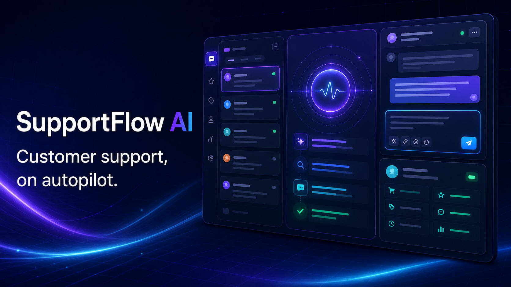

# SupportFlow AI

An AI-powered customer support command center for intelligent ticket triage, grounded reply drafting, automation, and customer context.

**Live application:** https://supportflow-ai-psi.vercel.app



## Product experience

- Priority inbox with urgent and high-priority filtering
- Interactive customer conversations and editable reply drafts
- AI intent, sentiment, risk, and confidence analysis
- Knowledge-grounded answer citations
- Customer profile, journey, account value, and similar-case context
- Autopilot status and support-performance metrics
- Responsive desktop and mobile layouts
- Custom Open Graph and social-sharing metadata

## Technology

- Next.js 16
- React 19
- TypeScript
- Responsive CSS
- Vercel production hosting
- Vinext and Cloudflare-compatible Sites build

## Current scope

This repository contains the polished interactive product prototype. Ticket data and AI analysis are currently simulated in the interface. The next phase will connect persistent ticket storage, live AI generation, a searchable knowledge base, and external support-channel automations.

## Run locally

```bash
npm install
npm run dev
```

For a standard Vercel-compatible production build:

```bash
npx next build
```

## Portfolio focus

SupportFlow AI demonstrates product design for complex operational workflows, dense responsive interfaces, AI-assisted user experiences, stateful React interactions, deployment configuration, and the ability to take a SaaS concept from idea to production.
